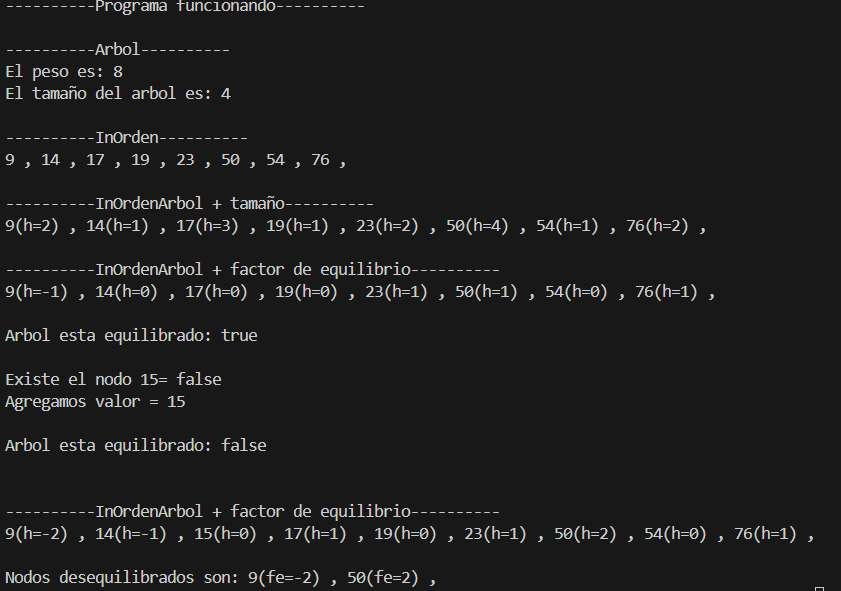

# Práctica de Algoritmos de Estructuras no lineales

## 📌 Información General

- **Título:** Práctica de Algoritmo Estructuras no lineales
- **Asignatura:** Estructura de Datos
- **Carrera:** Computación
- **Estudiante:** Jaime Loja
- **Fecha:** 19/06/2025
- **Profesor:** Ing. Pablo Torres

---

